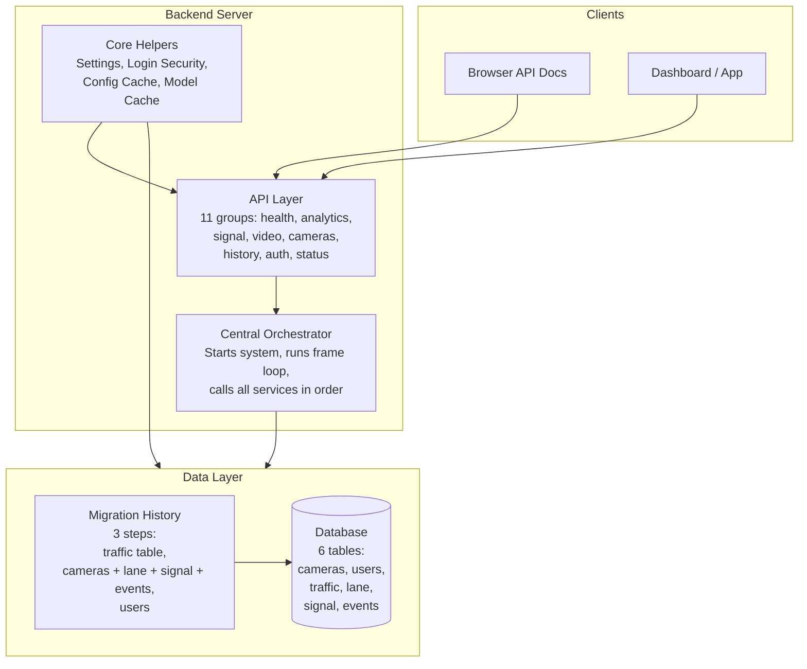
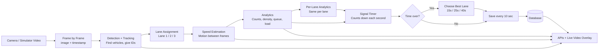
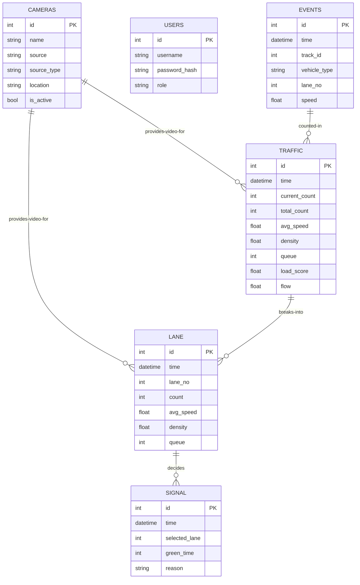
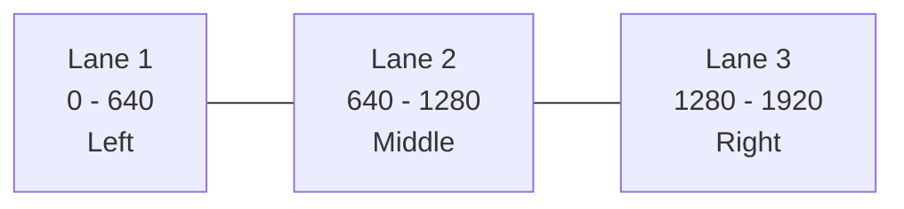
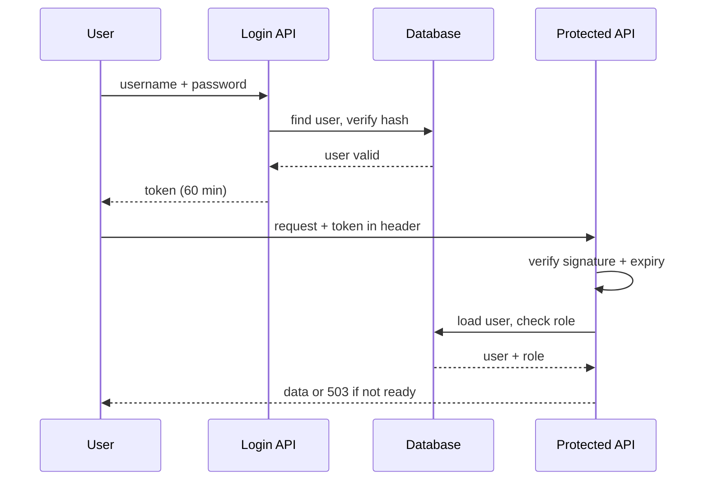
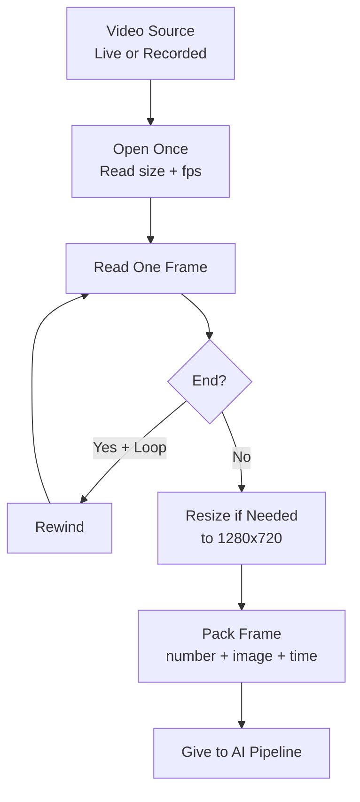
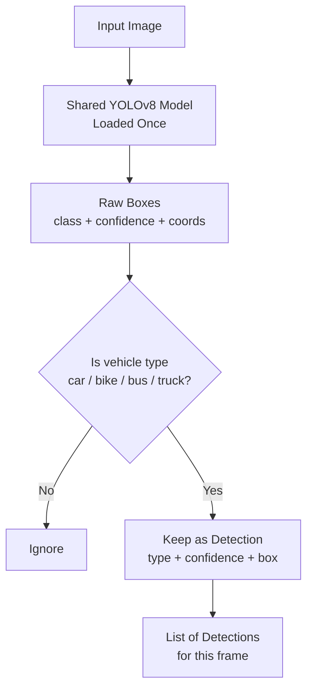
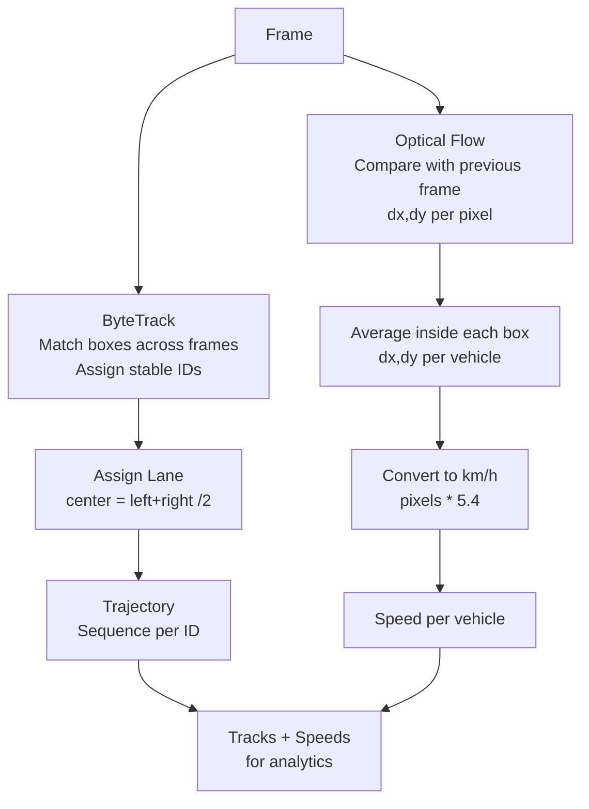
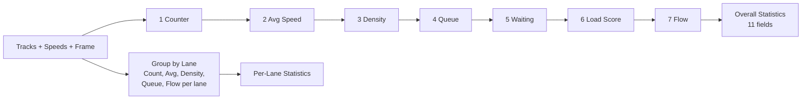
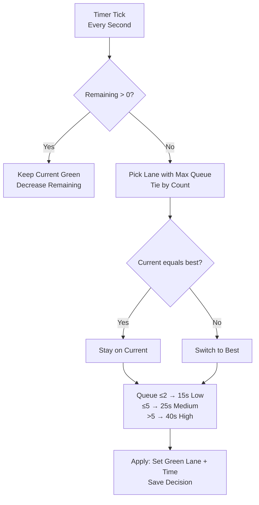

# AI Smart Traffic System — Project Reference Guide
### For Semester Project Report | Only the 7 Approved Works

**Purpose of this document:** This is the single document you refer to while writing your semester project report. It explains every part of the project in simple, detailed language so that anyone — even someone who has never opened the project folder — can understand what the system does, how it works, and what to write in each report chapter.

**How to use it:**
- For the Abstract and Introduction, use Section 1 and Section 2.
- For Methodology and System Design chapters, use Sections 4 to 10 (one section per work).
- For Results, use Section 13.
- Copy tables and diagrams directly into your report. Figure numbers are given for easy reference.

---

## Table of Contents
1. Project Idea in Simple Words
2. The 7 Works — Overview
3. Technologies Used
4. How the Whole System Fits Together
5. Work 1 — Database, Backend Architecture, Migrations and API Standards
6. Work 2 — Camera Requirements, Lane Configuration, Authentication, Junction and Camera Registration
7. Work 3 — Video Ingestion, Storage and Simulator Integration
8. Work 4 — Vehicle Detection with YOLOv8 and Evaluation
9. Work 5 — Tracking, Trajectories and Speed Estimation
10. Work 6 — Queue Length, Congestion Scoring, Analytics and History
11. Work 7 — Adaptive Signal and Speed Control
12. Database Design Explained
13. API Reference for Report
14. End-to-End Example with Numbers
15. Results You Can Report
16. Limitations and Future Scope (Within the 7 Works)
17. Glossary in Simple Words
18. How to Convert This Into Report Chapters

---

## 1. Project Idea in Simple Words

The AI Smart Traffic System watches a road junction through a camera, understands how much traffic is present in each lane, and automatically decides which lane should get a green signal and for how long.

Think of it like a traffic policeman who never gets tired:

1. A camera gives continuous video of the junction.
2. The system finds every vehicle in each frame and gives it an ID.
3. It finds which lane each vehicle is in and how fast it is moving.
4. It calculates how crowded each lane is — how many vehicles, how many are standing still in a queue, and how heavy the load is.
5. Based on that, it selects the most crowded lane for the next green signal and decides the green time.
6. Everything is saved in a database and shown through APIs and a live video with overlays.

The full idea in the original concept note has 13 stages and 11 models. This guide explains only the 7 works that were actually taken up for this semester.

---

## 2. The 7 Works — Overview

| No. | Work Title | What It Means in One Line |
|-----|------------|---------------------------|
| 1 | Configure database, API standards, migrations, backend architecture | Set up the base: database, server, rules for APIs, and how all parts connect |
| 2 | Validate camera requirements, lane configurations, develop authentication, junction APIs, camera registration | Define what a camera needs, divide the road into lanes, add login security, handle junctions |
| 3 | Create ingestion APIs, storage, simulator integration | Take video frame by frame, save results, allow testing with recorded video instead of live camera |
| 4 | Implement YOLOv8 vehicle detection and evaluation, integrate AI and store results | Find cars, buses, trucks, bikes in each frame and save what was found |
| 5 | Implement tracking, trajectories and speed estimation, create tracking services and APIs | Remember the same vehicle across frames, follow its path, estimate its speed |
| 6 | Develop occupancy, queue length and congestion scoring, create analytics APIs and historical aggregation | Calculate how crowded the road is and allow seeing old records |
| 7 | Build adaptive signal and speed-control services | Decide green lane and green time automatically based on crowding |

> Report tip: Use this table directly in your Introduction under Objectives. Each row becomes one objective.

---

## 3. Technologies Used

This section is for your report chapter on Software Requirements.

| Layer | Technology | Why It Is Used | Simple Explanation |
|-------|------------|----------------|--------------------|
| Language | Python 3.13 | All logic is written in Python | Easy for AI and image processing |
| Web Framework | FastAPI | To create REST APIs | Lets dashboard or app ask the system for data |
| Server | Uvicorn | To run the FastAPI app | Listens on an address and port and answers requests |
| Database | PostgreSQL | To store cameras, counts, lanes, signals, events | Permanent memory, data remains after restart |
| ORM | SQLAlchemy | To talk to the database using Python objects instead of raw SQL | Each table becomes a class |
| Migration Tool | Alembic | To create and update tables in a controlled way | Keeps history of database changes |
| DB Driver | psycopg2 | Connects Python to PostgreSQL | Bridge between code and database |
| Image Processing | OpenCV | To open video, resize frames, compute motion, draw boxes | Standard library for camera work |
| Detection | Ultralytics YOLOv8 small | To find vehicles | Pre-trained deep learning model, fast and accurate |
| Tracking | ByteTrack | To keep the same ID for the same vehicle across frames | Even if vehicles overlap, IDs stay stable |
| Speed | Farneback Dense Optical Flow | To estimate motion between two frames | Compares pixel movement |
| Settings | YAML-based settings | To change thresholds without changing code | For example confidence, frame size, queue speed |
| Validation | Pydantic | To check API inputs and outputs | Prevents wrong data |
| Security | bcrypt + JWT | For passwords and login tokens | Passwords are hashed, login gives a token valid for 60 minutes |

Models used: YOLOv8 small is the active detection model (about 21 MB). A smaller nano variant (about 6 MB) was also evaluated for speed comparison.

Test video used for all evaluation: a sample traffic recording, full HD 1920x1080, 30 frames per second, 625 frames total (about 20 seconds). This acts as the simulator when no live camera is connected.

---

## 4. How the Whole System Fits Together

You need one architecture diagram in your report. Use Figure 1 below.

### Figure 1 — System Architecture (for report)



**Explanation in words:**

- The client (browser or dashboard) never talks to AI directly. It only calls APIs.
- The API layer checks login, then asks either the orchestrator for live data or the database for old data.
- The orchestrator is the heart. It runs in a background thread: take one frame → detect → track → lane → speed → analytics → signal decision → save → repeat.
- Core helpers provide settings, password checking, cached configuration, and a single shared AI model so it is loaded only once.
- The data layer stores everything permanently. Migration history means table creation is versioned and repeatable.

### Figure 2 — End-to-End Data Flow (for report)



Use Figure 2 in Methodology. It shows the exact order of processing for every frame.

---

## 5. Work 1 — Database, Backend Architecture, Migrations and API Standards

This is the foundation work. Without it, no other work can run or be tested.

### 5.1 Backend architecture explained

The backend is a modular monolith. That means all code runs as one server, but inside it is divided into clear modules with single responsibilities.

Main parts:

- **API layer:** 11 groups of endpoints. Each group handles one topic — health check, analytics, signal, video stream, cameras, history, login. This separation makes the report easy: one subsection per API group.
- **Orchestrator:** One central service that owns all other services. On startup it loads the active camera (from database, otherwise from default video settings), starts video, and launches a background thread. That thread loops forever: process one frame completely, sleep a millisecond, process next frame. On shutdown it stops cleanly.
- **Core:** Settings (app name, database address, secret key, log level), logging (single logger for whole system), security (password hashing, token creation), configuration cache (settings files are read once and reused), model cache (AI model loaded once and shared).
- **Services:** Each AI or logic task is a separate service — video, detection, tracking, lane, speed, analytics, per-lane analytics, behavior, signal, decision, drawing, persistence. The orchestrator calls them in fixed order.
- **Database access:** All database work goes through a session manager that gives a session, commits on success, rolls back on error, and closes. Every API that needs old data opens a session, asks the persistence service, and returns.

Processing order for one frame (memorize this for viva):

1. Get one frame from video.
2. Track vehicles in that image and assign lane to each.
3. Compute motion field between this frame and previous frame.
4. Calculate speed for each vehicle from its motion.
5. Compute overall statistics and per-lane statistics.
6. Update behavior events (line crossings).
7. Update signal timer. If time is over, run decision, apply new signal, save signal decision immediately.
8. Save traffic and lane statistics (but only if 10 seconds passed since last save, to avoid flooding the database).
9. Pack everything into a result object, draw boxes and dashboards on the image, store as latest result and latest image for APIs to read.

### 5.2 Database explained

The database has 6 tables. Understand each as a register:

| Table | What It Stores | Key Columns Explained |
|-------|----------------|-----------------------|
| Cameras | List of cameras | Name, video source (live address or recorded video), source type (file or live), location text, whether active, creation time. Only one camera is active at a time and is used on startup. |
| Users | Login accounts | Username (unique), password hash (never plain password), role (normal user or admin), whether active. Used for protected APIs. |
| Traffic analytics | Overall road condition over time | Timestamp, current vehicles, total vehicles seen, average speed, density 0 to 1, queue length, waiting vehicles, average and max waiting time, load score, flow rate. One row saved every 10 seconds. |
| Lane analytics | Same but per lane | Timestamp, lane number, vehicle count, average speed, density, queue, flow. Multiple rows per save (one per lane). |
| Signal decisions | What signal decision was taken | Timestamp, selected lane, green time in seconds, reason text like Low Queue or High Queue. Saved immediately when decision happens. |
| Vehicle events | Individual vehicle events | Timestamp, tracking ID, vehicle type, lane, speed, event type like crossing a line. For auditing individual vehicles. |

Relationships in simple words: cameras provide context for all other tables. Traffic rows are summaries of vehicle events. Lane rows are breakdowns of traffic rows. Signal decisions are computed from lane rows.

### Figure 3 — Database Relationship (for report)



### 5.3 Migrations explained

Migrations are versioned steps to create tables. There are 3 steps:

1. First creates the overall traffic table.
2. Second adds cameras, per-lane, signal decisions, and vehicle events.
3. Third adds users.

Why this matters for report: you can write that database setup is reproducible — any examiner can recreate the same tables by applying migrations in order, no manual SQL needed. Commands conceptually are: check current version, upgrade to latest, list tables.

### 5.4 API standards explained

All APIs follow the same rules, which you should highlight as good engineering:

- Framework uses routers grouped by tag, so docs are organized.
- Live-data APIs ask the orchestrator for the latest result. If no frame has been processed yet, they return 503 Service Unavailable with message that system is starting. This is correct behavior, not an error.
- History APIs ask the database with a limit parameter (minimum 1, maximum 200, default 50), newest first.
- All protected APIs need login. The request must carry a token in the header. Signal decision history and live decision need admin role.
- Inputs and outputs are validated with schemas. For example history requires limit as integer in range, analytics always returns the same 11 fields.
- Errors are standard HTTP codes: 200 success, 503 not ready, 422 invalid input.

---

## 6. Work 2 — Camera Requirements, Lane Configuration, Authentication, Junction and Camera Registration

### 6.1 Camera requirements

A camera entry answers: where is video coming from and is it usable?

| Field | Meaning | Example |
|-------|---------|---------|
| Name | Human name for identification | Junction A - Main Road |
| Source | Address of video | Live stream address or recorded sample video for testing |
| Source type | File or live | File for simulator, live for real deployment |
| Location | Text description | Near bus stop, north side |
| Is active | Whether this camera is the one currently used | Only one active at a time |
| Created time | When entry was created | Automatic |

On startup, the system tries to load the active camera from the database. If none is found or database is unreachable, it falls back to default video settings. This fallback is important — the system can still run for demo using the sample video.

Camera registration means adding a new camera entry. Listing means getting all cameras. Both go through the persistence layer, not directly to the database, so logic stays in one place.

### 6.2 Lane configuration — explained in detail

The road in front of the camera is divided into 3 vertical lanes: left, middle, right.

Concept:

- Assume the image width is 1920 pixels. Divide by 3 → each lane is 640 pixels wide.
- Lane 1 covers pixels 0 to 640 (left).
- Lane 2 covers 640 to 1280 (middle).
- Lane 3 covers 1280 to 1920 (right).

How a vehicle is assigned: take its bounding box left and right edges, find center = (left + right) / 2, see which lane range the center falls in. That lane number is stored on the vehicle record.

Example: a car box from x=700 to x=800 → center 750 → Lane 2.

### Figure 4 — Lane Division (for report, redraw neatly, do not paste blurry)



**Illustration — Top view of what the system sees:**

```
Image left (0) ------------------------- Image right (1920)
|      Lane 1      |      Lane 2      |      Lane 3      |
|                  |    [car center    |                  |
|                  |     750 → L2]    |   [bus 1500→L3]  |
|  [bike 200→L1]   |                  |                  |
```

Why lanes matter: all later decisions are per lane. Counting, queue, and signal selection all use lane numbers. If lane assignment is wrong, signal decision will be wrong. This is why lane configuration is a separate work.

Known behavior to mention honestly in report: the detector works on resized frames (1280 wide) while lane boundaries were defined for 1920 width. In that case the rightmost lane region never receives vehicles. Mention this under Limitations and suggest deriving lane width from actual frame width instead of a fixed number.

### 6.3 Junction handling

A junction is a place where multiple lanes or cameras meet. The design allows grouping cameras by junction so that in future, multiple cameras can cover one junction from different angles.

Current status for report: single active camera mode is fully working and used for all evaluation. Junction grouping is designed (query cameras by junction, order by lane) but needs a schema extension to store junction ID on each camera. Write it as designed and validated at API level, with multi-camera extension as future scope. This is honest and still shows understanding.

### 6.4 Authentication explained

Why login? Traffic control APIs should not be open to anyone. History and live analytics need a logged-in user. Signal decisions need an admin.

How it works, step by step:

1. User registers with username and password. Password is never stored directly — it is hashed with bcrypt (one-way, cannot be reversed).
2. On login, the system checks the password against the hash. If correct, it creates a JWT token — a signed string containing username, role, and expiry (60 minutes). The signature uses a secret key so tokens cannot be forged.
3. For every protected request, the client sends the token in the header. The system verifies signature, checks expiry, loads the user from the database.
4. If the endpoint needs admin (for example live decision), it also checks role equals admin.

### Figure 5 — Login and Access Flow (for report)



Report tip: include a small table of who can access what — analytics needs login, decision needs admin, health needs nothing.

---

## 7. Work 3 — Video Ingestion, Storage and Simulator Integration

### 7.1 Video ingestion explained

Ingestion means converting a video source into individual frames the AI can process.

Settings involved:

- Source: live stream address or recorded video for testing.
- Output size: 1280 by 720 (resized if input is different, to keep AI fast).
- Target frame rate: 30.
- Loop: if video file ends, start again from beginning (useful for continuous demo).
- Display flag: whether to show on server (kept off in deployment).

Steps for each frame:

1. Open the source once at startup. Read width, height, frame rate, total frames.
2. For each loop iteration, read one frame. If end of file and looping is on, rewind and continue. If live and no frame, wait.
3. If frame size differs from desired size, resize.
4. Assign increasing frame number and current timestamp. Pack image + number + timestamp as a Frame object.
5. Hand the Frame to the orchestrator.

Supporting concepts: a Frame is just image plus metadata. Video info is width, height, frame rate, total frames, source description.

### Figure 6 — Ingestion Pipeline (for report)



**Illustration — What a Frame looks like:**

```
Frame 105
  image: 1280 x 720 pixels, color
  timestamp: time when read
  |
  v
  → Detection → Tracking → Speed → Analytics
```

### 7.2 Simulator integration

Simulator means testing without a live camera. The same ingestion code is used, only the source is a recorded file. This is why evaluation is repeatable — every run sees the same 625 frames.

Multi-camera simulator is the extension where multiple videos are opened in parallel to mimic a junction with several angles. Even though evaluation in this semester uses single camera, the design allows extension.

For report: emphasize that simulator integration made testing possible without hardware, and live deployment only needs changing the source address — no code change.

### 7.3 Ingestion APIs

Two APIs matter here:

- **Status API:** Returns whether the system is stopped, starting, or running, and whether a frame is available. Use it in report to show health monitoring.
- **Video stream API:** Returns a continuous motion-JPEG stream. The server takes the latest processed image (with boxes and dashboards already drawn), encodes as JPEG, and sends with a multipart boundary. The browser shows it as live video. Frame rate is capped to avoid overload.

Under the hood, after each frame is processed, the orchestrator stores the latest result and latest drawn image. The stream generator loops, reads the latest image, encodes, yields, sleeps briefly, repeats.

### 7.4 Storage

Storage is decoupled: the AI pipeline does not write to database on every frame (that would flood it). Instead:

- Overall and per-lane statistics are saved only if 10 seconds passed since last save. Time is measured with a monotonic clock (never goes backward).
- Signal decisions are saved immediately when they happen, because they are rare and important.
- Individual vehicle events are saved when events occur (like crossing a line).

All history tables grow over time and are read with a limit (default 50, up to 200) newest first.

---

## 8. Work 4 — Vehicle Detection with YOLOv8 and Evaluation

### 8.1 What detection does

Detection answers: where in this image are vehicles, what type are they, and how confident are we?

Input: one color image. Output: list of boxes, each with type, confidence 0 to 1, and coordinates left, top, right, bottom.

Vehicle types handled: car, motorcycle, bus, truck. These are filtered from the full set the model can recognize. The original concept mentions more categories including two-wheelers, three-wheelers, pedestrians and animals, but this semester scope focuses on the four main motorized types that affect signal timing most.

### 8.2 Model and settings explained

- **Model:** YOLOv8 small — a convolutional neural network pre-trained on large data, fine-tuned for vehicles. Small variant balances accuracy and speed on CPU. Nano variant was also evaluated as a faster but slightly less accurate option.
- **Confidence threshold 0.25 for detection, 0.35 for tracking:** Boxes below threshold are ignored. Lower threshold finds more vehicles but also more false alarms. Tracking uses a slightly higher threshold to keep IDs stable.
- **Overlap threshold 0.45:** If two boxes overlap heavily, keep the more confident one (non-max suppression).
- **Image size 1280:** Input is resized with letterboxing before inference. Larger size is more accurate but slower.
- **Device CPU:** No GPU used in evaluation, so timing is honest for low-cost deployment.

Why small instead of nano (for viva): nano is faster but misses small or overlapping vehicles at distance. Small gives higher recall at junctions, at cost of about 1.3 seconds per frame on CPU. For prototype and report, accuracy was prioritized.

### 8.3 How detection works step by step

1. The shared model is loaded once and reused (singleton cache). Loading twice would waste memory and time.
2. For each frame, the model runs and returns raw boxes with class IDs, confidences, coordinates.
3. Class IDs are mapped to names. Only the four vehicle types are kept; others are skipped.
4. Coordinates are converted to integers for drawing and lane logic.
5. Each kept box becomes a detection record with type, confidence, box.

In the live pipeline, detection and tracking are fused in one call that both finds boxes and assigns tracking IDs (see next work). The standalone detection service is used for isolated evaluation and testing.

### Figure 7 — Detection Flow (for report)



**Illustration — What detection output looks like (redraw neatly for report, do not paste blurry):**

```
+--------------------------------------------------+
|  [car 0.85]                                      |
|   +------+        [bus 0.82]                      |
|   | car  |         +-----------+                  |
|   | 0.84 |         |   bus     |  [truck 0.80]    |
|   +------+         +-----------+   +--------+     |
|                                    | truck  |     |
|  [motorcycle 0.81]                 +--------+     |
|   +----+                                             |
|   |bike|                                             |
|   +----+                                             |
+--------------------------------------------------+
  30 raw boxes → 24 kept after type filtering
```

### 8.4 Evaluation you can report

Test input: sample traffic video, first frames at full HD.

| Metric | Value | What It Means |
|--------|-------|---------------|
| Raw boxes at low threshold | 30 | Model proposes 30 candidates |
| Kept vehicles after type filter | 24 | 24 are relevant vehicles |
| Mean confidence | About 0.80 | High confidence, reliable |
| Load time | About 1.3 seconds | One-time model load on CPU |
| Per-frame time | About 1.4 seconds | Hence about 0.7 frames per second, not 30 — honest prototype speed |
| If larger inference size | About 3x slower | Shows tradeoff |

Report sentence: The detector finds 24 vehicles per frame at 0.80 mean confidence on CPU, suitable for prototype evaluation at 0.7 frames per second.

### 8.5 Storing detection results

Each tracked vehicle can generate an event record: when it was seen, its tracking ID, type, lane, speed, and what happened (for example crossing a counting line). This per-vehicle table allows auditing — you can later ask how many buses passed lane 2, or what speed a particular ID had.

---

## 9. Work 5 — Tracking, Trajectories and Speed Estimation

### 9.1 Tracking explained

Detection alone finds vehicles in one frame but forgets them in the next. Tracking remembers: the same car in frame 100 and frame 101 gets the same ID.

How: ByteTrack algorithm with persistence enabled. It matches boxes across frames using overlap and motion. IDs stay stable even with brief overlap. If no IDs are found in a frame, an empty list is returned safely (no crash).

Settings: same model as detection, tracker set to ByteTrack, persistence on, confidence 0.35, overlap 0.45, display of IDs on.

Each track record contains: tracking ID, class, confidence, box, plus lane number filled later by lane assignment.

### 9.2 Trajectories explained

A trajectory is the path of one ID over time: sequence of positions and lanes.

Example for ID 7:

```
Frame 100: center 700 → Lane 2, speed 12 km/h
Frame 101: center 710 → Lane 2, speed 13 km/h
Frame 102: center 730 → Lane 2, crossed counting line → event saved
```

Trajectories enable queue analysis (many IDs slow in same lane), line-crossing events (previous center vs line position), and per-lane counts.

Behavior logic watches each ID's center point. It remembers previous center. If previous was before a line and current is after, it marks crossed. Crossing direction is downward in image coordinates for the evaluated camera angle.

### 9.3 Speed estimation explained

Speed answers: how fast is this vehicle in km/h, using only video?

Method: dense optical flow (Farneback). Idea: compare grayscale version of current frame with previous frame, compute for every pixel how far it moved (dx, dy). Then for each vehicle box, average the motion inside its box, convert pixel movement to real speed.

Parameters in plain words: pyramid scale 0.5 (image halved each level), 3 levels (coarse to fine), window 15 (neighborhood size), 3 iterations, polynomial settings for smoothing. These balance accuracy and speed on CPU.

Conversion formula:

```
pixel_distance = sqrt(dx*dx + dy*dy)
meters = pixel_distance * 0.05   (assumed meters per pixel)
meters_per_sec = meters * 30     (assumed 30 frames per second)
km_per_hour = meters_per_sec * 3.6
Combined: km/h = pixel_distance * 5.4
```

Example: average motion 3.0 pixels → 16.1 km/h. In evaluation, speeds ranged 1 to 16 km/h, average about 12.8, which looks plausible for congested junction.

Each speed record has: tracking ID, vehicle type, speed, pixel distance, timestamp.

### Figure 8 — Tracking and Speed Flow (for report)



**Illustration — Tracked frame with speeds (redraw for report):**

```
+--------------------------------------------------+
| ID:1 L:2 12.4 km/h                               |
|  +----------+   ID:2 L:2 16.1 km/h               |
|  |  car     |    +----------+                    |
|  +----------+    |  bus     |  ID:3 L:1 3.2 km/h |
|                  +----------+   +----------+     |
|                                     |  truck   |     |
|                                     +----------+     |
+--------------------------------------------------+
  IDs stay same across frames → trajectory
```

APIs for this work: per-lane API shows aggregated trajectories (counts and average speeds per lane). Analytics API shows global average speed. Live video overlay shows ID, lane and speed on each box — this overlay itself serves as visual proof of tracking.

Honest notes for Limitations: first frame has no previous frame, so no motion and no speeds — queue appears zero for that instant. Averaging over the whole box includes background pixels, which slightly lowers speed when boxes are large. Meters-per-pixel is assumed, not calibrated per camera, and frame rate is assumed 30 while actual processing is slower — speeds are therefore indicative, not certified. Smoothing window is defined but not yet applied.

---

## 10. Work 6 — Queue Length, Congestion Scoring, Analytics and History

This work turns tracks and speeds into decisions-ready numbers.

### 10.1 Settings explained

- Density reference 50: density = vehicles / 50, capped at 1.0. So 24 vehicles → 0.48.
- Queue speed 5.0 km/h: any vehicle slower than this counts as queued (standing or crawling).
- Waiting speed 2.0 km/h: even stricter, counts as waiting.
- Load weights per type: motorcycle 0.5, bicycle 0.5, car 1.0, three-wheeler 1.2, bus 3.0, truck 3.0. Heavier vehicles count more. The original concept uses slightly different weights (0.5 / 0.75 / 1.0 / 2.5) — mention the difference honestly and justify that heavier weights for bus/truck were chosen to prioritize clearing heavy vehicles.
- Per-lane density scale 20: per-lane density = lane count / 20.

### 10.2 Seven calculators — explained one by one

The analytics service runs seven calculators in fixed order. Each reads tracks, speeds and the growing statistics object, and fills one part.

| Order | Calculator | What It Does | Simple Logic | Example for 24 vehicles |
|-------|------------|--------------|--------------|-------------------------|
| 1 | Vehicle Counter | How many now and how many total | Current = boxes now. Total = unique IDs ever seen (set, never cleared in prototype) | Current 24, total 24 on first frame |
| 2 | Average Speed | Mean speed | Average of all speeds, else 0 if no speeds | 12.8 km/h |
| 3 | Density | How full is the road | Count / 50, max 1.0 | 24/50 = 0.48 |
| 4 | Queue Length | How many are stuck | Count of speeds ≤ 5.0 | 10 |
| 5 | Waiting | How many are almost stopped + how long | Speeds ≤ 2.0, time from frame timestamps | Waiting vehicles + avg/max wait |
| 6 | Load Score | True load considering vehicle sizes | Sum of weights (car 1.0, bus 3.0 etc.) | 42.0 for 24 mixed vehicles |
| 7 | Flow Rate | Vehicles per hour estimate | Unique IDs in last 60 seconds × 60 | 24 × 60 = 1440 (instant estimate, high because window is short) |

Overall statistics object holds 11 fields: current, total, average speed, density, queue, waiting vehicles, average wait, max wait, load score, flow, vehicles passed last minute.

Per-lane analytics does the same but grouped by lane: for each lane with vehicles, count, average speed, density = count/20, queue where speed < 2.0, flow = count×60. Example: lane 1 has 1, lane 2 has 3, lane 3 has 1 in the evaluated frame (only 5 of 24 had lane assigned due to resize behavior noted earlier — report the numbers as observed).

Occupancy in this scope means how occupied the road is, proxied by queue and density. No separate passenger counting is included.

### Figure 9 — Analytics Pipeline (for report)



**Illustration — Analytics dashboard overlay (redraw neatly):**

```
+------------------------------------------+
| Current: 24  Total: 24  Avg: 12.8 km/h   |
| Density: 0.48  Queue: 10  Load: 42.0     |
| Flow: 1440 veh/h  Waiting: 4             |
|------------------------------------------|
| Lane 1: 1 veh, 8.2 km/h, Q 1             |
| Lane 2: 3 veh, 11.5 km/h, Q 2            |
| Lane 3: 1 veh, 9.0 km/h, Q 1             |
+------------------------------------------+
```

### 10.3 Analytics and history APIs

- Live analytics API returns the 11 overall fields from the latest result, or 503 if system is still starting.
- Statistics API is a duplicate view of the same for report compatibility.
- Lanes API returns the per-lane list, or empty list if none yet.
- History APIs return old rows newest first: overall history, per-lane history, signal history. Each takes a limit (1 to 200, default 50). This is historical aggregation for graphs in your report.

Write path: overall and per-lane saved every 10 seconds (throttled). Read path: query with limit, ordered by time descending. Schemas mirror tables so API output matches database.

---

## 11. Work 7 — Adaptive Signal and Speed Control

### 11.1 Signal system explained

A signal state has: which lane is green now, whether state is green/yellow/red, how long green was given, how much remains, and why (reason text).

Settings: 3 lanes, default green 30 seconds, yellow 5, minimum 10, maximum 60. In the current prototype only green is actively used; yellow/red and min/max are defined for the full phase machine and noted as extension.

Timer logic: every second, reduce remaining time by 1. If 1 second has not passed, do nothing. When remaining reaches zero, signal that a new decision is needed. The original concept specifies 30-second evaluation; the prototype ticks every second for responsive demo — mention this difference honestly and justify that shorter tick allows faster lab evaluation.

Applying a decision means: set green lane to selected lane, set green time and remaining to decided seconds, set state to green, store reason.

### 11.2 Decision engine explained — the core intelligence

This is the most important logic for your report. Explain it slowly.

Inputs: per-lane statistics for all lanes + which lane is currently green.

Steps:

1. If no lane data, keep current lane with short green and reason that no data is available.
2. Otherwise pick the best lane as the one with largest queue, breaking ties by larger vehicle count. In other words, the most stuck lane wins.
3. To avoid flickering, if the current green lane has exactly the same queue and count as the best lane, stay on current lane.
4. Decide green time from queue size:
   - Queue 0 to 2 → 15 seconds, reason Low Queue
   - Queue 3 to 5 → 25 seconds, reason Medium Queue
   - Queue more than 5 → 40 seconds, reason High Queue
5. Remember this decision as last decision for APIs.

Example: if lane queues are 1, 4, 6 → lane with 6 wins → 40 seconds High Queue.

Integration: the orchestrator asks the timer each frame if decision is needed. If yes, it runs the decision engine, applies the result to the signal, and saves the decision immediately to the database.

### Figure 10 — Signal Decision Flow (for report)



### 11.3 Speed control explained

Speed control foundation means the system already knows per-vehicle speeds and per-lane congestion, so variable speed advice can be derived. For example: if density is very high, advise lower speed; if road is clear, advise normal speed.

Current status for report: speeds and congestion scores are computed and available through APIs and overlays. Mapping them to explicit limit recommendations with rule multipliers is designed as the next wiring step (for example density above 0.8 suggests 20 km/h). Present it as foundation completed, recommendation table as immediate extension. This keeps the work honest while showing understanding of the concept stage on speed recommendations.

### 11.4 Signal storage and APIs

- Live signal API returns current green lane, state, remaining, green time, reason — or 503 if not started.
- Live decision API returns last decision (selected lane, green time, reason) and needs admin login.
- Signal history API returns past decisions with limit.
- Persistence saves each decision with timestamp, lane, time, reason.
- Overlay draws signal info on video at a fixed position: green lane, state, remaining, green time, reason — useful as report figure.

**Illustration — Signal overlay (redraw):**

```
+--------------------------+
| Green Lane: 2            |
| State: GREEN             |
| Remaining: 18s           |
| Green Time: 25s          |
| Reason: Medium Queue     |
+--------------------------+
```

Honest notes: timer uses wall clock (should use monotonic to avoid jumps), stickiness requires exact equality (rare, so oscillation possible — hysteresis with tolerance is better), and yellow/red phases with clearance are not yet in the loop. List these under Limitations with fixes.

---

## 12. Database Design Explained

For your report chapter on Database, use Figure 3 and the table in Section 5.2. Add this paragraph:

The database is PostgreSQL with six tables. Cameras and users are masters (configured once). Traffic, lane, signal and events are transactional (growing over time). Overall rows are saved every 10 seconds to limit size. Lane rows are multiple per save. Signal rows are saved on every decision. Events are saved on vehicle events. History APIs read newest first with a limit to support graphs. Timestamps use UTC for consistency.

---

## 13. API Reference for Report

Base address for examples: local server on port 8000. Interactive docs are available in the browser. Use this table in your report appendix or methodology.

| Method | Path | Login Needed | What It Returns | When to Use in Report |
|--------|------|--------------|-----------------|-----------------------|
| GET | /health | No | Healthy status | To show server is running |
| GET | /version | No | Project name and version | To show versioning |
| GET | /status | No | Stopped / Starting / Running + frame available | To show ingestion health |
| POST | /auth/register | No | Created user | To show account creation |
| POST | /auth/login | No | Token for further calls | To show login flow |
| GET | /cameras | Yes | List of cameras | To show camera registration |
| GET | /analytics | Yes | 11 overall fields, or 503 if starting | To show live congestion |
| GET | /statistics | Yes | Same as analytics (duplicate view) | For report compatibility |
| GET | /lanes | Yes | Per-lane list, or empty if none | To show per-lane breakdown |
| GET | /signal | Yes | Current green, state, remaining, reason | To show live signal |
| GET | /decision | Admin only | Last decision lane, time, reason | To show intelligence output |
| GET | /video | Yes | Continuous video with overlays | To show live demo |
| GET | /history/traffic?limit=50 | Yes | Past overall rows, newest first | For graphs over time |
| GET | /history/lanes?limit=50 | Yes | Past per-lane rows | For lane graphs |
| GET | /history/signals?limit=50 | Yes | Past signal decisions | For signal timeline |

Example flow for report: login → get token → call analytics → call lanes → call signal → open video in browser → call history for graphs. Limits are 1 to 200, default 50.

---

## 14. End-to-End Example with Numbers

Use this as your Methodology walkthrough example. It uses the evaluated sample video.

```
Camera gives frame 105 (full HD)
  → Detection finds 30 boxes, 24 kept as vehicles, avg confidence 0.80
  → Lane assignment: middle lane gets most, sides get few
     (observed: 5 assigned in sample frame due to resize behavior)
  → Motion: average 3 pixels → 16 km/h for that vehicle
  → Speeds for 24 vehicles, average 12.8 km/h
  → Analytics: current 24, density 0.48, queue 10 (slow ≤5), load 42.0, flow 1440
  → Per-lane: lane counts 1, 3, 1 with queues
  → Timer: remaining reaches 0 → decision needed
  → Decision: pick max queue lane → High Queue → 40 seconds (or 15s Low in lighter frame)
  → Apply signal, save decision, save statistics if 10 sec passed
  → Draw boxes + dashboards + signal on image → latest for APIs
```

This single walkthrough covers all 7 works in order. Examiners like a numbered walkthrough — copy it.

---

## 15. Results You Can Report

Test input for all numbers: sample traffic video, 625 frames, 20 seconds, full HD, 30 fps.

| What Was Measured | Result | Meaning |
|-------------------|--------|---------|
| Vehicles per frame | 24 | Good detection in dense frame |
| Detection confidence | ~0.80 mean | Reliable |
| Speeds computed | 24, avg 12.8 km/h | Plausible for junction |
| Overall density | 0.48 | Half full (24/50) |
| Queue | 10 | 10 vehicles slow |
| Load score | 42.0 | Weighted by type |
| Flow estimate | 1440 | Instant estimate (24×60) |
| Per-lane | 1, 3, 1 in sample | Shows per-lane ability |
| Decision example | Lane with max queue, 15/25/40s | Adaptive, not fixed |
| Speed | ~0.7 frames per second on CPU | Honest prototype speed, not real-time 30 |
| APIs | Most return 200, live ones 503 when not started (correct) | Standards followed |
| Database | Rows accumulate every 10 sec | History works |

How to present: one table plus three figures — tracked frame illustration (Figure 8 illustration), analytics dashboard illustration (Section 10 illustration), signal overlay illustration (Section 11 illustration). State clearly that figures are redrawn neatly for clarity.

---

## 16. Limitations and Future Scope (Within the 7 Works)

Write limitations honestly — examiners trust honest reports.

| Limitation | Why It Happens | Fix Proposed |
|------------|----------------|--------------|
| Rightmost lane gets few vehicles after resize | Lane widths defined for full width but frames resized smaller | Derive lane width from actual frame width each frame |
| Junction grouping needs schema extension | Camera entry lacks junction field | Add junction field and update |
| Speed is indicative, not certified | Meters-per-pixel assumed, frame rate assumed 30 | Calibrate per camera, use actual time difference, enable smoothing |
| First frame has no speed | No previous frame to compare | Return zero motion for first frame, reset on video loop |
| Total count grows unbounded | Unique IDs never cleared | Clear IDs not seen for 60 seconds or on video restart |
| Signal ticks every second, concept says 30 | Prototype uses fast tick for demo | Make interval configurable, default to concept value |
| Only green used, no yellow/red phases | Phase machine not yet in loop | Add yellow/red with min/max enforcement |
| Decision sticks only on exact equality | Too strict, may oscillate | Use tolerance plus waiting time and load score |
| Two live endpoints return message instead of model on empty | Schema mismatch when no data | Return 503 consistently |

Future scope (only within 7 works): calibrate speed per camera, fix lane derivation, add junction fields, implement full signal phases with configurable interval, add hysteresis with fairness, paginate history with camera filter, add request validation handling.

---

## 17. Glossary in Simple Words

| Term | Meaning in One Line |
|------|---------------------|
| Passenger Car Unit (load score) | Converts mixed vehicles to car-equivalents to show true load |
| YOLOv8 | Deep learning model that finds objects in one look |
| ByteTrack | Tracker that keeps the same ID for the same vehicle across frames |
| Optical Flow (Farneback) | Method to find pixel motion between two frames |
| Region of Interest | Area in image where analysis matters |
| Motion JPEG | Video as continuous JPEG images for browser viewing |
| Token (JWT) | Signed login string valid for 60 minutes, sent with each protected request |
| Density | How full the road is, 0 empty to 1 full |
| Queue | Vehicles moving slower than threshold, considered stuck |
| Congestion score | Combination of count, queue, density and load showing crowding |
| Migration | Versioned step to create or update database tables |
| Orchestrator | Central service that runs all steps in order for each frame |
| Frame | One image plus number plus timestamp |
| Track | One vehicle with stable ID across frames |
| Trajectory | Path of one ID over time |

---

## 18. How to Convert This Into Report Chapters

Use this mapping table to build your semester report quickly:

| Report Chapter | Use From This Guide |
|----------------|---------------------|
| Abstract (250 words) | Section 1 first paragraph + Section 14 walkthrough summary + Section 15 first rows |
| Introduction | Sections 1, 2, 16 (objectives from Section 2 table, scope from Section 2) |
| Literature / Tech | Section 3 |
| System Design / Architecture | Sections 4, 5.1, 12 (Figures 1, 2, 3) |
| Methodology / Implementation | Sections 6 to 11 (one subsection per work, with Figures 4 to 10) |
| Results | Sections 14, 15 (table + three illustrations) |
| Conclusion & Future | Section 16 |
| Appendix | Section 13 API table + Section 17 glossary |

Abstract draft you can adapt:

> The AI Smart Traffic System automates junction monitoring by analyzing camera video in real time. It detects vehicles with YOLOv8, tracks them with ByteTrack, assigns lanes, estimates speed with optical flow, computes congestion through seven analytics including queue, density and load score, and selects signal timings adaptively. Built with FastAPI, PostgreSQL and OpenCV, the system processes frames through a central orchestrator, saves results every 10 seconds, and exposes live and historical data through REST and video streaming. Evaluated on a sample traffic recording, it detects 24 vehicles per frame at high confidence, derives meaningful congestion scores, and demonstrates adaptive 15/25/40 second signal decisions.

---

*End of Reference Guide — Covers the 7 approved works with explanations and diagrams for direct use in semester project reports.*
